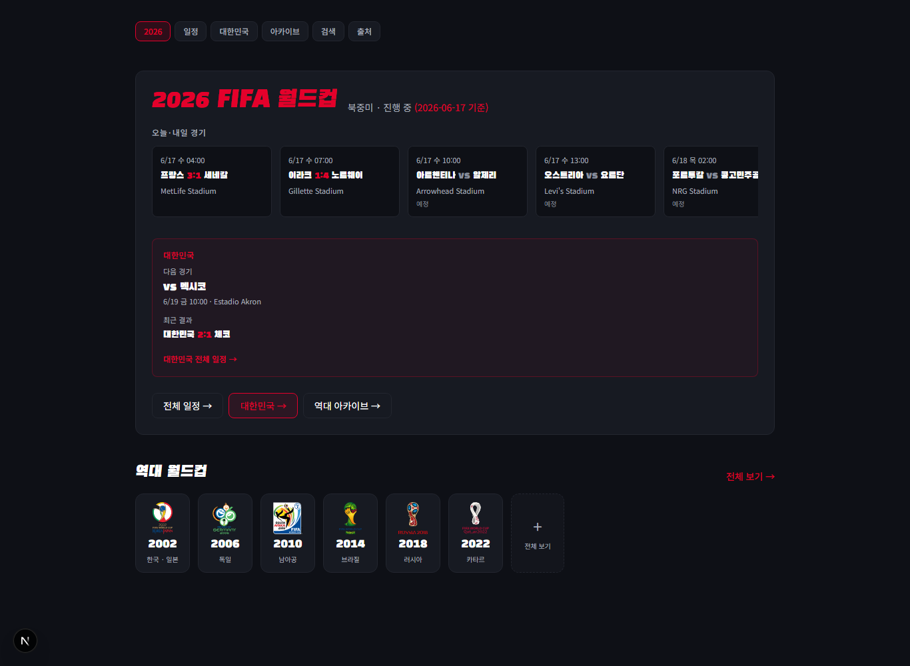
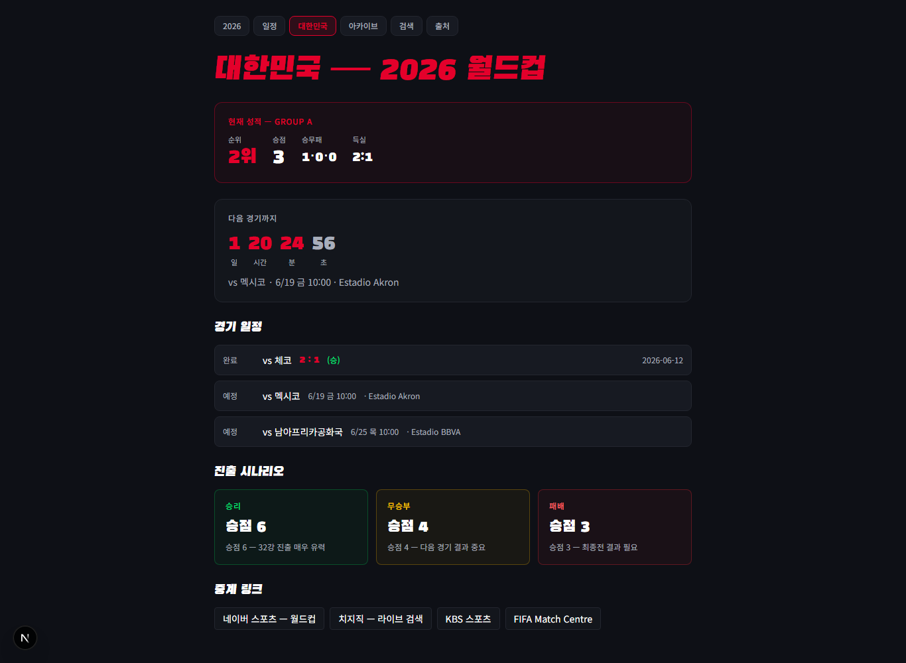
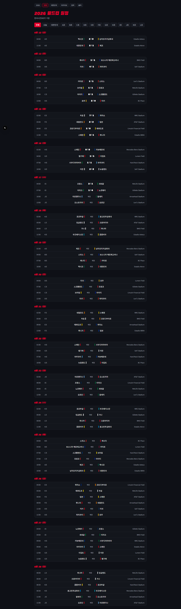
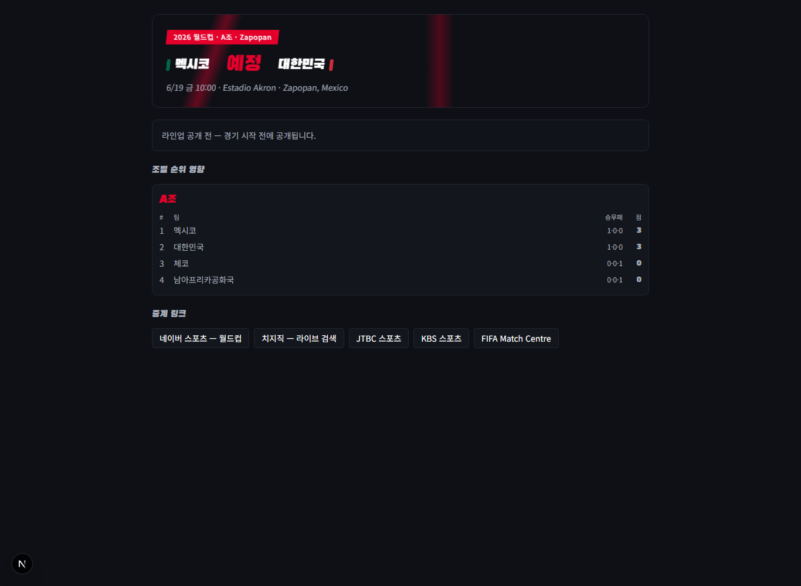
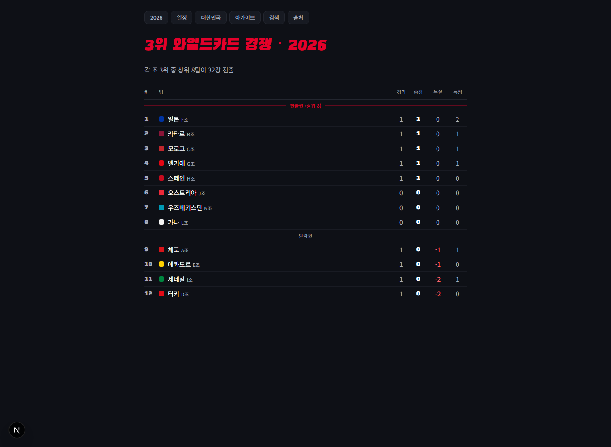
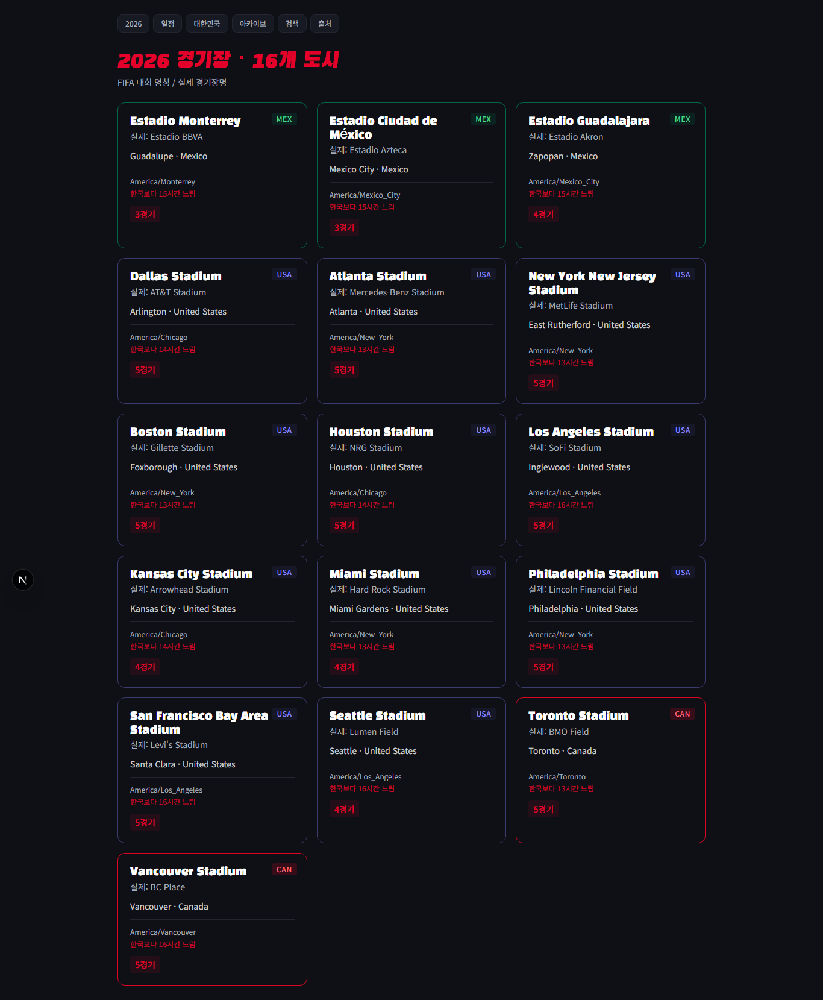
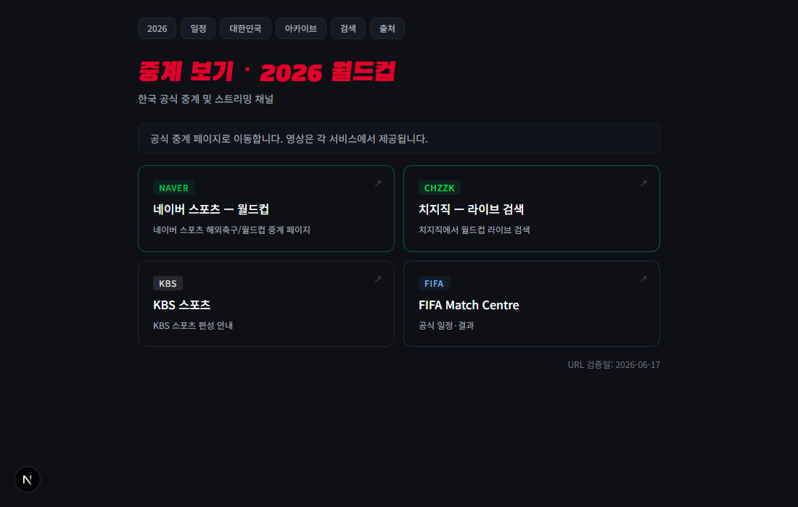
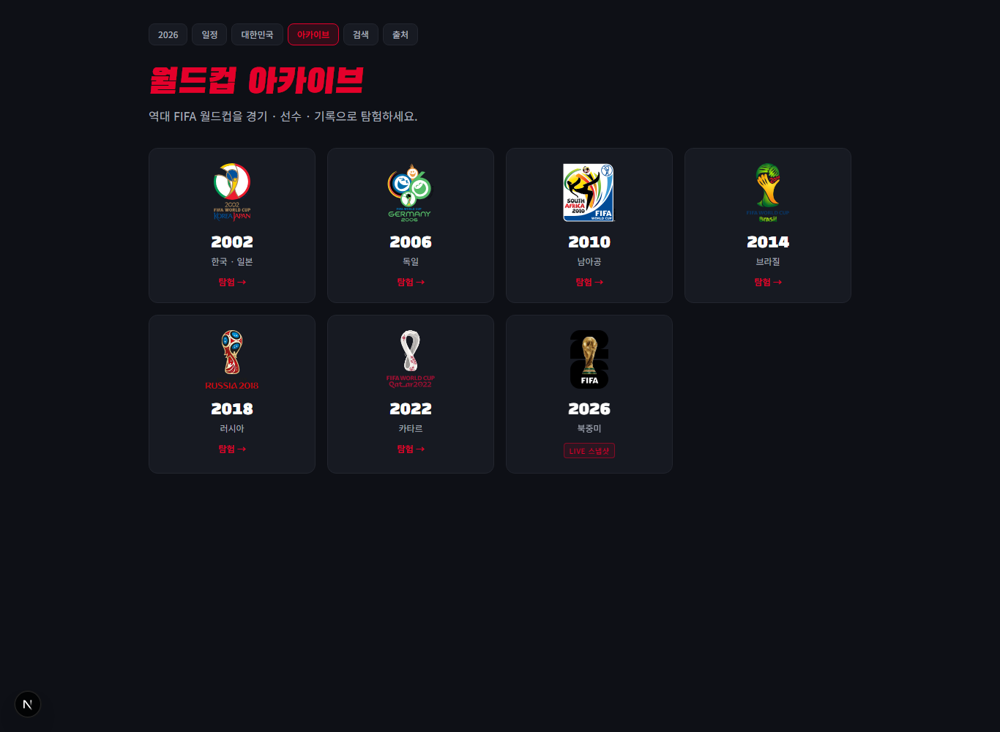
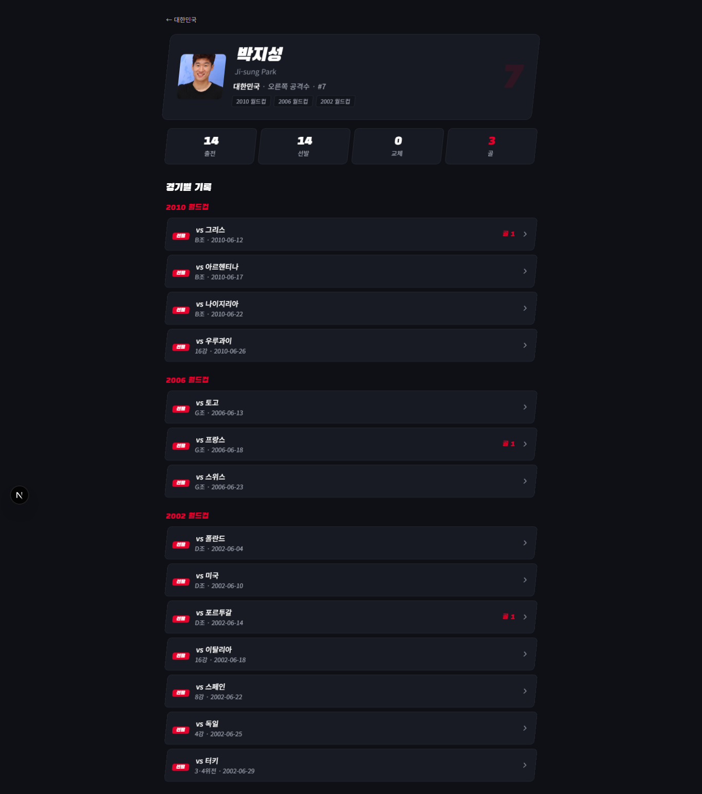

# ⚽ 월드컵 아카이브 + 2026 라이브 허브

**2026 월드컵을 정직한 현황으로 보고, 끝나면 그대로 역사 아카이브가 되는 한국어 월드컵 데이터 사이트.**

진행 중인 **2026 북중미** 월드컵(일정·조 순위·대한민국·중계)을 메인에 두고, **2002–2022 역대 7개 대회**를 경기·선수·기록으로 깊게 탐험한다.

```
정적 사이트(SSG) · 런타임 DB 없음 · 데이터는 빌드 시 JSON으로 구워 커밋
라이브 데이터 피드/채팅/백엔드 없음 — 2026은 "N월N일 기준" 수동 스냅샷(추측 금지)
```

---

## 화면

### 메인 — 2026 현황 허브
오늘·다가오는 경기(KST), 대한민국 다음 경기, 그리고 하단에 역대 대회 아카이브.



### 대한민국 트래커
현재 순위·다음 경기 카운트다운·경기 일정(완료/예정)·**진출 시나리오 계산**·중계 링크.



### 전체 일정 (KST)
한국시간 기준 날짜별·매치데이·조별·대한민국 필터. 진행 경기는 스코어, 미진행은 "예정".



### 경기 페이지 — 예정 / 완료 분기
예정 경기는 킥오프(KST)·경기장·"라인업 공개 전"·조별 순위 영향·중계 링크. 완료 경기는 라인업·득점·교체·승부차기.




### 3위 와일드카드 경쟁
12개 조 3위 중 상위 8팀이 32강 진출 — 진출권/탈락권 경계 표시.



### 경기장 · 도시
16개 경기장. FIFA 대회 명칭 / 실제 경기장명 분리, 한국과의 시차.



### 중계 허브 · 역대 아카이브 · 선수 페이지





> 선수 카드는 호버 시 미리보기, 클릭 시 사진·생년월일·키·소속팀 이력 모달.

---

## 주요 기능

**2026 (진행 중 · 스냅샷)**
- 2026 현황 메인 허브 + KST 전체 일정(매치데이/조/대한민국 필터)
- 대한민국 트래커 — 순위·카운트다운·**진출 시나리오 계산(순수함수)**
- 3위 와일드카드 경쟁표(48팀·12조·상위 3위 8팀 진출)
- 경기장/도시(FIFA·실제명, 시차), 중계 링크 허브(네이버·치지직·KBS·FIFA)
- 경기 상태 분기: `예정`("라인업 공개 전") / `완료`. **추측 데이터 0 — 미진행 경기는 스코어 없음, 라인업 비움**

**아카이브 (2002–2022 · 완결)**
- 조별리그 → 녹아웃 전 과정: 순위표, 대진표, 최종 순위
- 경기별 풀 라인업(선발 11 + 교체, 시간·대상) — *누락 0경기*, 승부차기 키커별 성공/실패
- 통합 선수 페이지(여러 대회 합산) + 호버 미리보기 + 상세 모달
- 한글 우선: 국가명·포지션(`골키퍼`/`미드필더`)·라운드(`16강`/`8강`/`4강`)·조(`D조`), 영문 병기
- 국가별 킷 컬러, 다년도 통합 검색, 다크+키네틱 모션(`prefers-reduced-motion` 대응)

---

## 정보 구조 (라우트)

```
/                            2026 현황 허브 + 하단 역대 아카이브
/archive                     역대 7개 대회 선택 그리드
/world-cup/2026              2026 대회 메인(조 순위 · 진행 중)
/world-cup/2026/schedule     전체 일정 (KST)
/world-cup/2026/korea        대한민국 트래커 + 진출 시나리오
/world-cup/2026/third-place  3위 와일드카드 경쟁
/world-cup/2026/venues       경기장 · 도시
/world-cup/2026/watch        중계 링크 허브
/world-cup/[year]            역대 대회(조 보드 + 최종 순위)
/world-cup/[year]/bracket    토너먼트 대진표
/world-cup/[year]/groups/[group], /matches/[slug], /teams/[slug]
/players/[slug]              선수 통합 페이지   /search   /sources
```

상단 네비: `2026 · 일정 · 대한민국 · 아카이브 · 검색 · 출처`.

---

## 2026 데이터 — 정직성 원칙

2026은 FIFA가 진행 중인 대회라 데이터 소스(Fjelstul DB)에 없다. 공개 자료(Wikipedia 조별 페이지)에서 **수동 스냅샷**으로 수집한다.

- **조별 72경기**(팀·KST 킥오프·경기장) 수록. 진행 경기만 `완료`+스코어, 나머지는 `예정`.
- 녹아웃(32강~)은 **대진 미확정**이라 보류(추측 금지) — 팀 확정 후 추가.
- **라인업/스코어를 지어내지 않는다.** 검증 가능한 결과만 반영, `asOf`로 기준일 명시.
- 갱신: `scripts/fixtures-2026.ts`의 결과를 새 데이터로 바꿔 `npx tsx scripts/build-2026.ts` 재실행.

라이브 스코어 자동 갱신·실시간 채팅·백엔드는 **의도적으로 도입하지 않음**(정적 정체성 유지).

---

## 데이터 출처 · 라이선스

| 용도 | 출처 | 라이선스 |
|---|---|---|
| 경기/라인업/순위 (척추, 2002–2022) | [Fjelstul World Cup Database](https://github.com/jfjelstul/worldcup) | CC BY-SA 4.0 |
| 2026 일정·결과 스냅샷 | Wikipedia (per-group) | 사실 자료(저작권 비대상) |
| 스코어·순위 교차검증 | [openfootball/worldcup.more](https://github.com/openfootball/worldcup.more) | CC0 |
| 한글 표기·약력 | Wikipedia / Wikidata | 사실 자료 |
| 선수 사진 | [Wikimedia Commons](https://commons.wikimedia.org) | 이미지별 자유 라이선스(CC BY/BY-SA/CC0/PD), 저작자 표기 |

> 가공 데이터셋은 원본을 따라 **CC BY-SA 4.0**. 대회 엠블럼 권리는 FIFA에 있으며 비영리·식별 목적 표시. 중계는 외부 공식 링크만(영상 임베드 없음).

---

## 기술 스택

- **Next.js 16** (App Router, Turbopack, SSG `generateStaticParams`) · **React 19** · **TypeScript**
- **Tailwind CSS v4** (CSS-first `@theme`)
- **Vitest** (순수 함수 TDD — KST 변환·진출 시나리오·3위 랭킹) · **tsx** (데이터 스크립트)
- 런타임 DB 없음 — 데이터는 `data/generated/<연도>/*.json`으로 빌드 시 구워 커밋

---

## 로컬 실행

```bash
npm install
npm run dev      # http://localhost:3000
npm run build    # 정적 빌드 (7개 대회 전 페이지 prerender)
npm test         # vitest
```

## 데이터 파이프라인

```bash
# 아카이브 연도 (Fjelstul): fetch → generate → validate
npm run data:build            # 2002
npm run data:build:2006       # 2006 (다른 연도는 인자로)
npx tsx scripts/fetch-fjelstul.ts 2010
npx tsx scripts/generate.ts 2010
npx tsx scripts/validate.ts 2010
npx tsx scripts/enrich-players.ts 2010   # Wikidata/Commons 사진·약력
npx tsx scripts/missing-teams.ts 2010    # 한글명/킷 컬러 누락 국가 점검

# 2026 (라이브 스냅샷)
npx tsx scripts/build-2026.ts            # fixtures-2026.ts → matches/standings/venues
npx tsx scripts/validate.ts 2026         # 72경기·킥오프·경기장·진행경기 스코어 게이트
```

`data/raw/`는 `.gitignore`(원본 CSV·캐시). `data/generated/`·`public/players/*.jpg`는 커밋.

### 새 아카이브 연도 추가
`scripts/generate.ts` HOST + (선택)`validate.ts` TRUTH → `data:build` → `enrich-players` → 신규국 `lib/teamColors.ts` 한글명·색 추가 후 재생성 → `lib/tournaments.ts`에 `status` 등록.

---

## CI / 배포

- **GitHub Actions** (`.github/workflows/ci.yml`): `npm ci` → lint(비차단) → `tsc` → `vitest` → `validate`(7개년) → `build`.
- 정적 빌드라 **Vercel** 또는 개인 서버(Docker + Caddy) 모두 가능 — [`docs/DEPLOY.md`](docs/DEPLOY.md).
