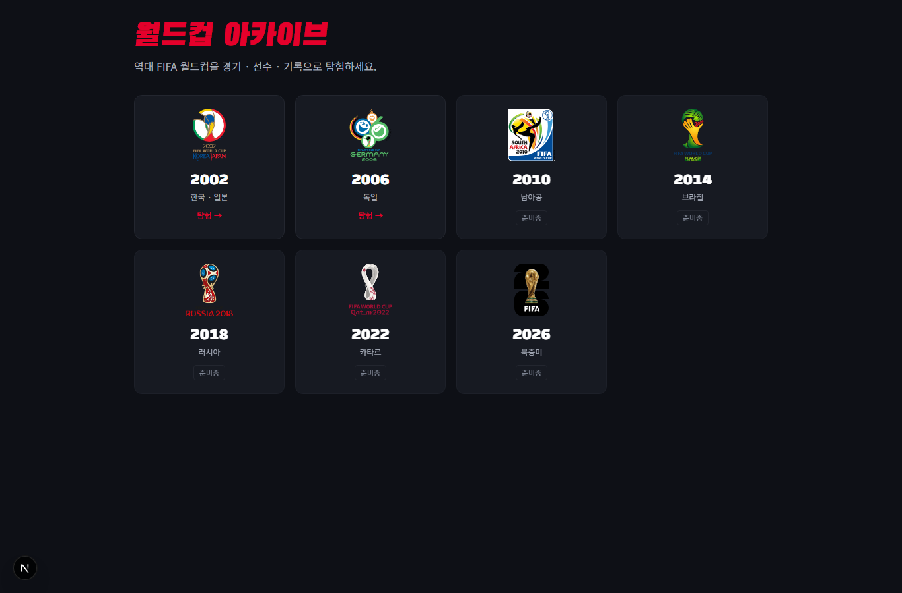
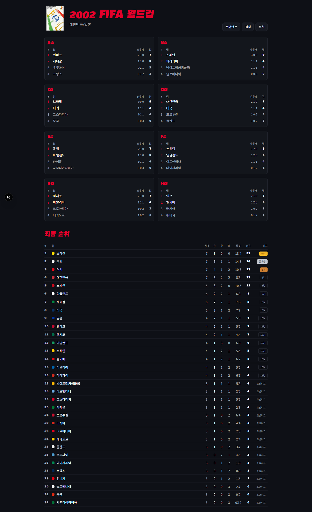
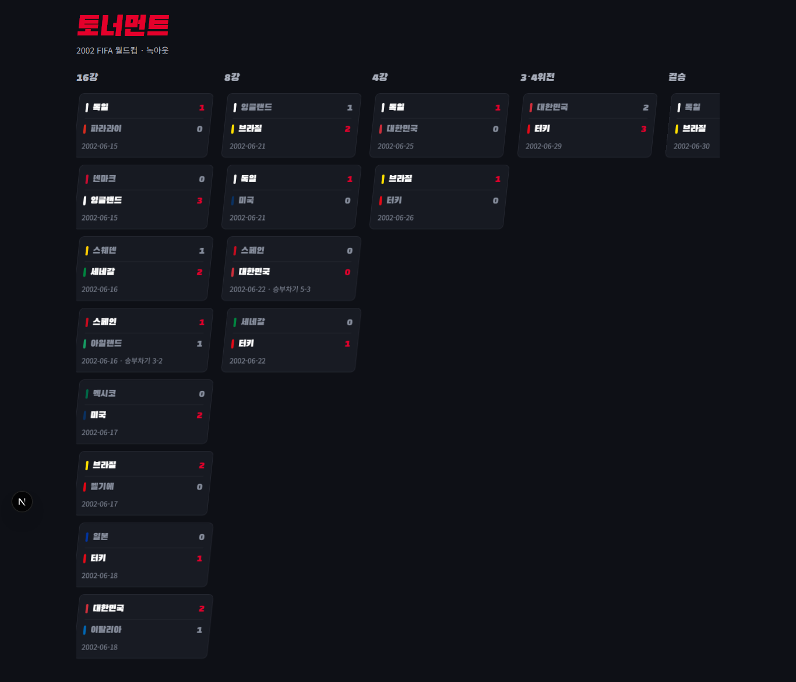
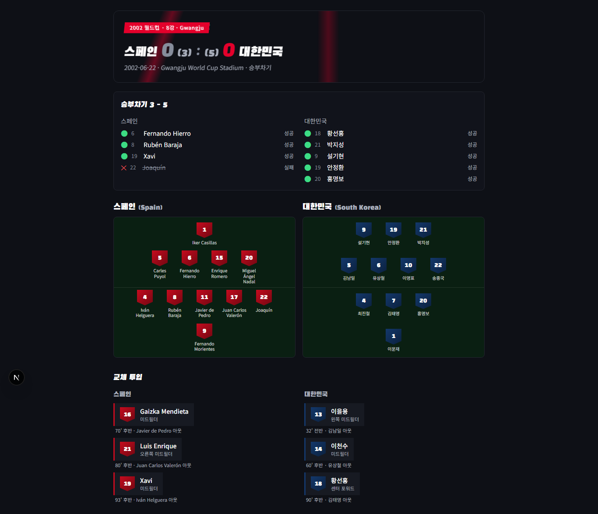
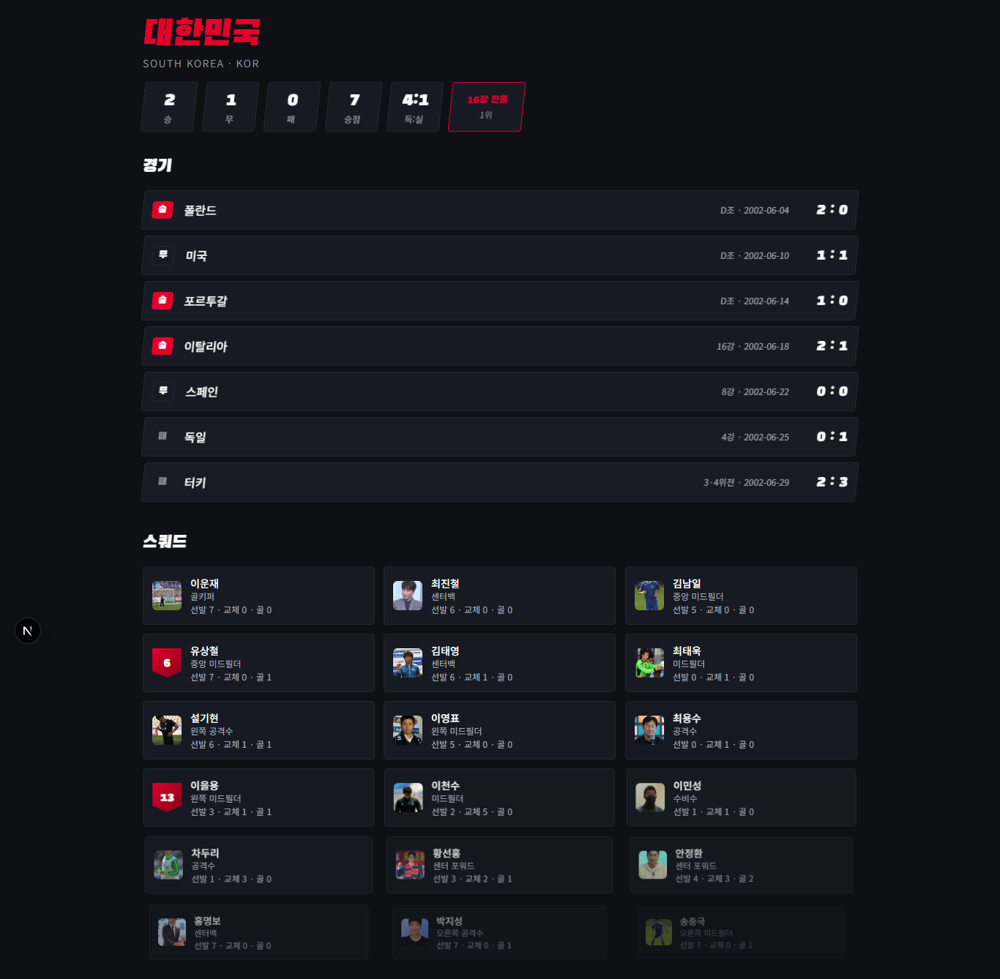
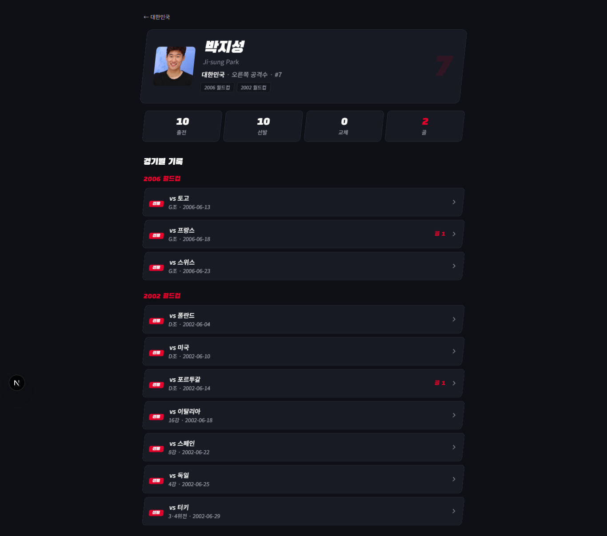

# ⚽ 월드컵 아카이브 (World Cup Archive)

역대 FIFA 월드컵을 **경기 · 선수 · 기록**으로 탐험하는 한국어 인터랙티브 아카이브.
조별리그 순위부터 녹아웃 대진, 경기별 선발 라인업·교체·득점·승부차기, 선수 개인 페이지까지 한 곳에서 본다.

현재 **2002 한·일** 월드컵과 **2006 독일** 월드컵이 라이브.

```
정적 사이트(SSG) · 런타임 DB 없음 · 데이터는 빌드 시 JSON으로 구워 커밋
```

---

## 화면

### 메인 — 대회 선택
역대 대회를 엠블럼 그리드로. 데이터가 준비된 대회만 "탐험" 활성화.



### 대회 페이지 — 조별 순위 + 최종 순위
8개 조 순위 보드와 우승~조별탈락까지 정렬된 최종 순위표.



### 토너먼트 대진표
16강 → 8강 → 4강 → 3·4위전 → 결승. 국가별 대표 색 바, 승부차기 스코어 표기.



### 경기 페이지 — 라인업 · 교체 · 승부차기
양 팀 포메이션을 피치 위에 배치(국가색 구분), 득점·교체 시간, 승부차기는 키커별 성공/실패까지.



### 국가 페이지 — 전적 · 경기 · 스쿼드
승·무·패·승점·득실, 라운드별 경기(나라 왼쪽 / 점수 오른쪽 정렬), 사진이 들어간 스쿼드.



### 선수 페이지 — 여러 대회 통합
한 선수의 출전을 **대회별로 묶어** 표시. 사진·포지션·통산 기록, 대회마다 다른 라운드 라벨.



> 카드를 호버하면 미리보기, 클릭하면 사진·생년월일·키·소속팀 이력이 담긴 모달이 뜬다.

---

## 주요 기능

- **조별리그 → 녹아웃 전 과정**: 순위표, 대진표, 최종 순위(우승/준우승/3위/4위/8강/16강/조별리그).
- **경기별 풀 라인업**: 모든 경기의 선발 11명 + 교체 명단(시간·교체 대상 포함). *누락 0경기.*
- **승부차기 상세**: 키커 순서·성공/실패·득점 스코어.
- **선수 카탈로그**: 통합 선수 페이지 + 호버 미리보기 + 상세 모달(사진/생년월일/키/소속팀 이력/약력).
- **한국어 우선**: 국가명(`독일`)·포지션(`골키퍼`/`미드필더`)·라운드(`16강`/`8강`/`4강`)·조(`D조`) 전부 한글. 영문명도 병기.
- **국가별 대표 색**: 32개국 킷 컬러로 대진·라인업 시각 구분, 색 충돌 시 대비색 fallback.
- **다년도 검색**: 선수·국가·경기 통합 검색.
- **모션 디자인**: 다크 테마 + 키네틱 슬라이드/스큐 모션, `prefers-reduced-motion` 대응.

---

## 데이터 출처 · 라이선스

| 용도 | 출처 | 라이선스 |
|---|---|---|
| 경기/라인업/순위 (척추 데이터) | [Fjelstul World Cup Database](https://github.com/jfjelstul/worldcup) | CC BY-SA 4.0 |
| 스코어·순위 교차검증 | [openfootball/worldcup.more](https://github.com/openfootball/worldcup.more) | CC0 |
| 한글 표기·약력 보강 | Wikipedia / Wikidata | 사실 자료(저작권 비대상) |
| 선수 사진 | [Wikimedia Commons](https://commons.wikimedia.org) | 이미지별 자유 라이선스(CC BY/BY-SA/CC0/PD), 저작자 표기 |

> 가공 데이터셋은 원본을 따라 **CC BY-SA 4.0**으로 제공. 대회 엠블럼의 모든 권리는 FIFA에 있으며 비영리·식별 목적 표시. 사진은 자유 라이선스만 사용하고 저작자는 각 선수 카드와 `/sources`에 표기.

---

## 기술 스택

- **Next.js 16** (App Router, Turbopack, SSG `generateStaticParams`)
- **React 19** · **TypeScript**
- **Tailwind CSS v4** (CSS-first `@theme`)
- **Vitest** (순수 함수 TDD) · **tsx** (데이터 스크립트)
- 런타임 DB 없음 — 데이터는 `data/generated/<연도>/*.json`으로 빌드 시 구워 커밋.

---

## 로컬 실행

```bash
npm install
npm run dev      # http://localhost:3000
```

```bash
npm run build    # 정적 빌드 (2002 + 2006 전 페이지 prerender)
npm test         # vitest
```

## 데이터 파이프라인

```bash
npm run data:build         # 2002: fetch → generate → validate
npm run data:build:2006    # 2006 동일

# 개별 단계 (연도 인자, 기본 2002)
npx tsx scripts/fetch-fjelstul.ts 2006   # Fjelstul에서 해당 대회 추출
npx tsx scripts/generate.ts 2006         # matches/standings/tournament JSON 생성
npx tsx scripts/validate.ts 2006         # 64경기·선발 11명·정답지 게이트
npx tsx scripts/enrich-players.ts 2006   # Wikidata/Commons 사진·약력 (ENRICH_LIMIT로 상한)
```

`data/raw/`는 `.gitignore`(원본 CSV·캐시). `data/generated/`·`public/players/*.jpg`는 커밋.

### 새 대회 연도 추가

1. `scripts/generate.ts`의 `HOST`, `scripts/validate.ts`의 `TRUTH`에 해당 연도 추가
2. `data:build:<연도>` 실행 → `enrich-players.ts <연도>`
3. 신규 출전국이 있으면 `lib/teamColors.ts`에 한글명·킷 컬러 추가 후 `generate` 재실행
4. `lib/tournaments.ts`에서 `available: true` — 나머지 라우트/검색/선수 페이지가 자동 반영

---

## 배포

정적 빌드라 **Vercel** 또는 개인 서버(Docker + Caddy) 모두 가능. 자세한 설정은 [`docs/DEPLOY.md`](docs/DEPLOY.md).
